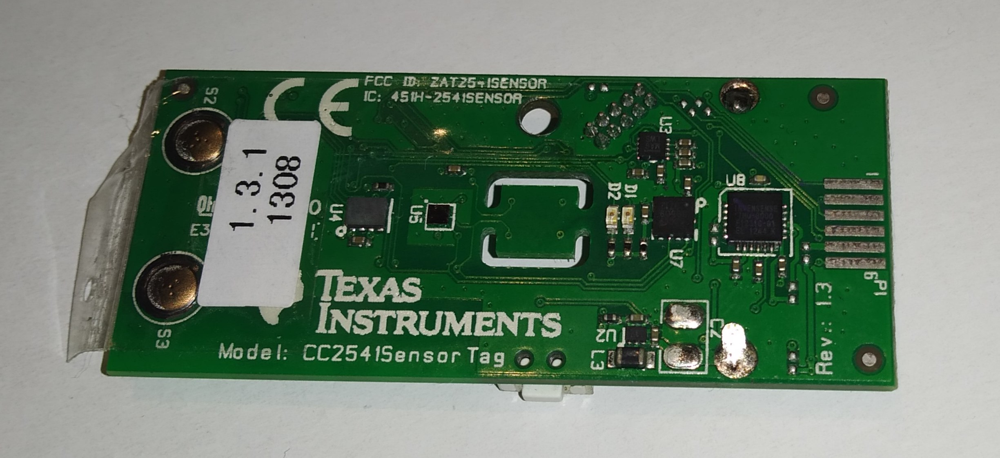

# TI SenorTag CC2541

Obsługa modułu TI SenorTag CC2541 (rok produkcji 2013) z modułem BT LTE za pomocą skryptu Python działającej na RaspberryPi. 

<ul>
<li><a href="https://github.com/marianwitkowski/misc/blob/master/ti-cc2541/sensor-test.py">Przykładowy kod (Python 3.7)</a>
<li><a href="swru324b.pdf" target="_new">Dokumentacja modułu (PDF)</a>
</ul>

Moduł zawiera:
<ul>
<li>Contactless IR temperature sensor (Texas Instruments TMP006)
  
<li>Humidity Sensor (Sensirion SHT21)

<li>Gyroscope (Invensense IMU-3000)

<li>Accelerometer (Kionix KXTJ9)

<li>Magnetometer (Freescale MAG3110)

<li>Barometric pressure sensor (Epcos T5400)

<li>On-chip temperature sensor (Built into the CC2541)

<li>Battery/voltage sensor (Built into the CC2541)
</ul>

